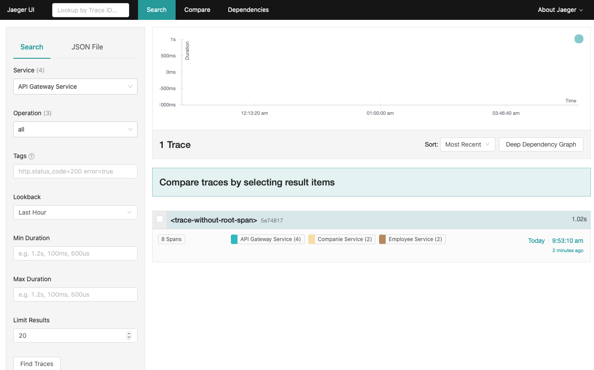

# PoC sur Opentracing, Jaeger, Spring et Docker

## Objectifs

Ce `Proof of concept` (PoC) a plusieurs objectifs :
* Valider le fonctionnement du framework Opentracing
* Intégrer Opentracing dans les projets Java et SpringBoot
* Utiliser Jaeger pour afficher et suivre les traces des appels RESTful
* Utiliser Docker pour construire les projets type Java & Maven
* Valider le fonctionnement d'Opentracing dans un cluster Swarm
* En bonus, l'analyse automatique de la qualité de code avec SonarQube

## Architecture

Ci-dessous le schéma d'architecture que nous souhaitons mettre en oeuvre. 
Il est composé de trois microservices Spring Boot embarquant Opentracing pour le tracing des appels REST et traitements métiers :
* **API Gateway** : ce service sert à router les appels aux sous services (comapnie et employee) 
* **Companie** : ce service retourne aléatoirement un nom de société à partir d'une liste définie
* **Employee** : ce service retourne aléatoirement un nom d'employé à partir d'une liste définie


Les traces des appels sont envoyées au server `Jaeger` via le protocol `UDP` sur les ports 5775, 6831 et 6832.

## Technologies

Voici la liste des technologies utilisées :

* Java SE 11
* Spring Boot 2.2.1
* Maven 3.6
* Opentracing 2.0.3 (pour Jaeger)
* Docker Engine v19+
* Compose v1.24+

---

## Comment utiliser ce projet ?

### Prérequis

* Docker Engine v19+
* Compose v1.24+
* Accès à internet

### Etape 1 : Récupérer le projet Git

```bash
git clone https://github.com/nntran/opentracing-spring.git
```

Chaque microservice pourrait être compilé séparément soit avec `Maven` (si vous disposez d'un environnement de build opérationnel) ou avec `docker-compose`. C'est la dernière méthode qui sera utilisée pour la suite.


### Etape 2 : Build avec `docker-compose`

La compilation de nos microservcies (en Java et Maven) se fait via docker, nous n'aurons pas à installer d'autres outils/frameworks sur notre machine.

Pour compiler et démarrer nos trois microservices (gateway, companie et employee) sous forme de conteneur docker, il suffit d'executer la commande suivante depuis la racine du projet. 

```bash
docker-compose up --build
```

Nous devrions avoir ces traces affichées depuis notre terminal : 


Les microservices peuvent aussi être compilés unitairement via cette commande :

```bash
docker-compose up --build <nom-service-docker>
```

Par exemple :

```bash
docker-compose up --build company
```

### Etape 3 : Tests

Tout d'abord, commençons par ajouter le nom de domaine `api.docker.lan` dans notre fichier `hosts` de notre machine locale:

```bash
echo '127.0.0.1    api.docker.lan' >> /etc/hosts
```

Nous pouvons maintenant utiliser l'outil `curl` ou avec notre `navigateur` web pour tester le WS `/v1/names/random` exposé par l'API gateway.

```bash
curl http://api.docker.lan:8090/v1/names/random
```

Le WS devrait nous retourner un nom de société concaténé avec un nom d'employé fictif. Par exemple :

```
Sanofi - Adolphe Quetelet
```
  
### Comment arrêter les services ?

Pour arrêter les conteneurs docker en cours d'exécution, plaçons-nous à la racine du projet et lançons la commande ci-dessous : 

```bash
docker-compose down
```

```
Stopping company  ... done
Stopping employee ... done
Stopping gateway  ... done
Stopping jaeger   ... done
Removing company  ... done
Removing employee ... done
Removing gateway  ... done
Removing jaeger   ... done
Removing network private
```

---

## Comment déployer les services avec l'orchestrateur Docker Swarm ?

L'idée est de pousser ce PoC plus loin pour vérifier si nos services sont scalables et que Opentracing et Jaeger fonctionnent bien avec l'orchestrateur Swarm. 

Nous allons donc enrichir notre schéma d'architecture en ajoutant `Docker Swarm` pour orchestrer nos services et `Traefik` pour `loadbalancer` ces derniers.


### Etape 1 : Initialiser Swarm

Commençons par initialiser le `cluster Swarm` en local (1 seul noeud manager).

```bash
docker swarm init
```

### Etape 2 : Déployer Traefik

[Traefik](https://docs.traefik.io/) est un reverse proxy très puissant. Il nous permet de simplifier la vie en découvrant automatiquement nos conteneurs docker (services) et de router nos traffics (http, https, tcp) vers les services demandées.

Executons la commande ci-dessous pour déployer `Traefik`:

```bash
docker stack deploy -c ./deployment/traefik/docker-stack.yaml proxy
```

```
Creating network traefik-net
Creating config proxy_traefik-config
Creating service proxy_traefik
```

Ajoutons le nom de domaine `traefik.docker.lan` dans notre fichier `hosts` de notre machine locale:

```bash
echo '127.0.0.1    traefik.docker.lan' >> /etc/hosts
```

Le dashboard de Traefik est maintenant accessible à partir de cet URL : http://traefik.docker.lan/dashboard#/


### Etape 3 : Déployer Jaeger

Comme pour Traefik, nous allons déployer `Jaeger` avec la commande ci-dessous :

```bash
docker stack deploy -c ./deployment/jaeger/docker-stack.yaml tracing
```

```
Creating service tracing_jaeger
```

Ajoutons le nom de domaine `jaeger.docker.lan` dans notre fichier `hosts` de notre machine locale:

```bash
echo '127.0.0.1    jaeger.docker.lan' >> /etc/hosts
```

Le dashboard de Jaeger est maintenant accessible à partir de cet URL : http://jaeger.docker.lan


### Step 4 : Déployer les microsservices Spring Boot

Déployons maintenant nos services :

```bash
docker stack deploy -c ./deployment/docker-stack.yaml sample
```

```
Creating service sample_employee
Creating service sample_gateway
Creating service sample_company
```

### Step 5 : Véfifier l'état des services

Vérifions que tous nos services sont correctement déployés dans Swarm :

```bash
docker service ls
```

```
ID                  NAME                     MODE                REPLICAS            IMAGE                            PORTS
yi1fx7alrdxq        proxy_traefik            replicated          1/1                 traefik:v2.1                     *:80->80/tcp, *:443->443/tcp, *:8080->8080/tcp
qgs6smalryy1        sample_company           replicated          3/3                 tracing-company:latest   
h0eyhi9qr03j        sample_employee          replicated          3/3                 tracing-employee:latest   
3knv81wl6auh        sample_gateway           replicated          1/1                 tracing-gateway:latest    
5tt2z8hvp0y6        tracing_jaeger           global              1/1                 jaegertracing/all-in-one:1.15    *:5778->5778/tcp, *:9411->9411/tcp, *:14268->14268/tcp, *:16686->16686/tcp, *:5775->5775/udp, *:6831-6832->6831-6832/udp
```

Par défaut, les services `companie` et `employee` sont déployés avec chacun trois `replicas`, c'est-à-dire trois instances. 

### Comment tester ?

Effectuons quelques appels REST avec `curl` :

```bash
curl http://api.docker.lan/v1/names/random
```

Resultat :

```
Société Générale - Evangelista Torricelli
```

Revenons dans Jaeger et nous verrons que les appels au différents WS sont tous tracés :)




## Comment supprimer les stacks déployées

```bash
docker stack rm <nom-stack>
```

## Qualité de code avec SonarQube


Sonar est utilisé pour analyser la qualité du code des projets. Vous pouvez démarrer un Sonar Server en local avec cette commande:

```bash
docker-compose -f docker/sonar.yaml up -d
```

Sonar est accessible via http://localhost:9091

- User : admin
- Password: admin

Vous pouvez lancer une analyse Sonar via Maven:

```bash
# ./mvn -Pprod clean verify sonar:sonar
./mvn clean verify sonar:sonar
```

Ou avec docker-compose:

```bash
export SONAR_ENABLE=true
export SONAR_URL=http://192.168.13.36:9091

docker-compose -f docker-compose.yaml up --build
```
